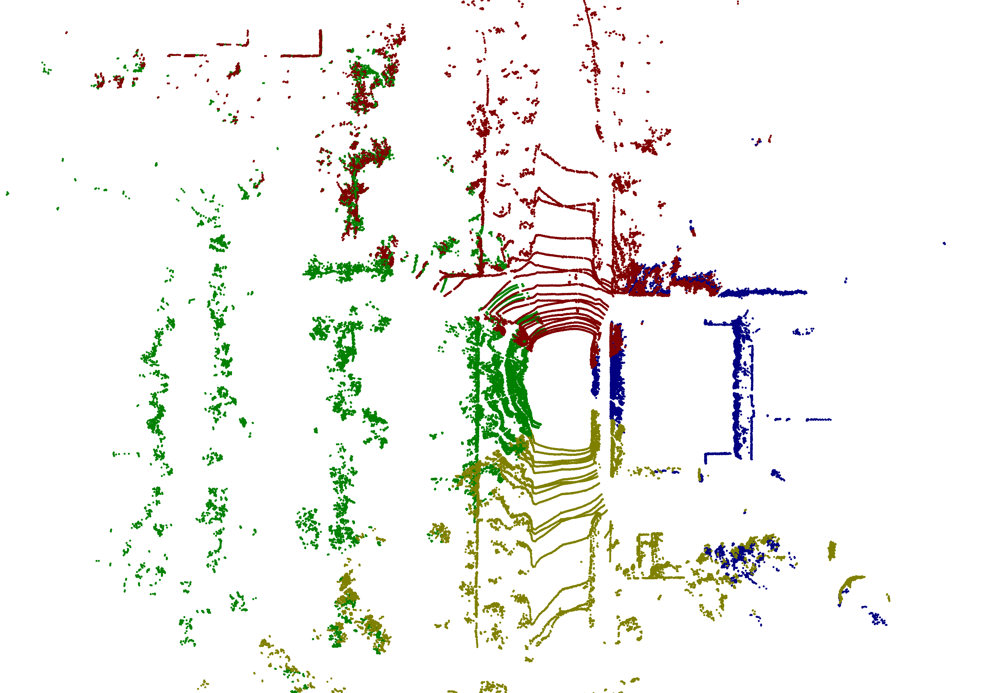

# OGDT_multi_lidar_calibration
### A matlab-c++ toolbox to calibrate the extrinsic parameters between the multi_beam LiDARs using the plane contraints and 2D occupancy grid map matching.  

 

## Citation
If you find our codes and method useful to your work, please consider citing this work:

    The Artical is now underview.

### The experiment aims at the extrinsic calibration between the multi-beam lidars of the SHARINGVAN platform which has four leishen CH32 Lidars around the vehicle at the front ,left, right and the rear.  

  

### After extrinsic calibration between the Lidars, we can transform the left, right and rear point cloud to the coordinates of the front Lidar.  

  

### We also provide the basic demo script for extrisic calibration for adjacent Lidars which is the common case to meet the requrements of your application.  

## How to run the demo
- **Prepare your environment**  
The code of this project is mainly written by Matlab. The core algorithm processing and optimization process are realized by C++ code. This part of the code is compiled and called by the mex of matlab. We also provide a full set of tools to help you organize your data and visualize the results. This part of the code is implemented through Python. Therefore, we recommend that you use the Ubuntu system, and install Matlab with a version not lower than R2017b to meet the requirements.  

- **build the code**  
Assuming that the directory of your current workspace is `WORKSPACE`.  

  `cd WORKSPACE/planeGridMapMatching`  
  run the m file `build.m` to build the `estimateExtrinsic2dMapDtMatchingCeresMex`  

  `cd WORKSPACE/tools/matlab/utils/linefit_ground_segmentation`  
  run the m file `build.m` to build the `groundSegmentationMex` and `estimatePitchRollByNormalCeresMex`  

  `cd WORKSPACE/tools/matlab/utils/pointCloud2OccupancyGridMap`  
  run the m file `build.m` to build the `levelingPoints2OccupancyGridMex`,  `laserscanSectorOverlappingMex`, `laserscan2OccupancyGridMex` and `points3dSectorOverlappingMex`  

- **data preparation**  
We provide some demo data to test the code, including real data and simulation data. You can use the link below to download the corresponding data, and modify the corresponding variables in the code to point to the location where you store the data.  
[ch32_4](https://drive.google.com/file/d/1JV5YsGJBPr9Ty315YOa_ciNgr4fNkyZf/view?usp=sharing)  

  Change your parameters to refer to the dataset:  
  | parameter | value  |
  |:------------:|:-----:|
  | data_root | absolute directory for the dataset |
  | tools_matlab | absolute directory for the tools |

- **run the demo**  
Assuming that the directory of your current workspace is `WORKSPACE`.  

  `cd WORKSPACE/planeGridMapMatching/demo`  
  run the m file `script_estimate_extrinsic_2dDTMatching_CERES_four.m` to estimate the extrinsic parameters and concate the point cloud.  